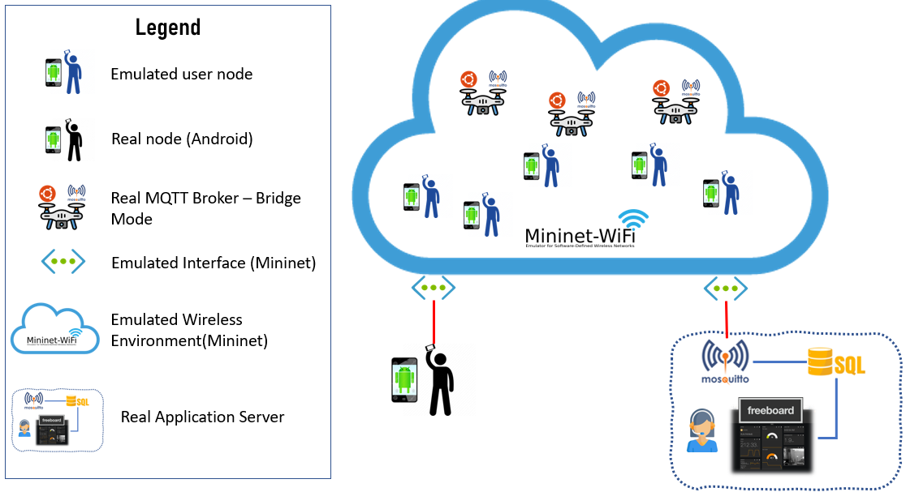
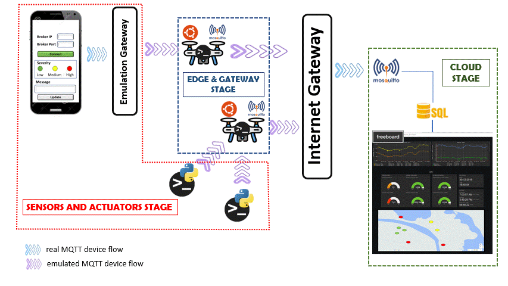

<!-- Improved compatibility of back to top link: See: https://github.com/ErnoMitrovic/WebSeekers/pull/73 -->

<!--
*** Thanks for checking out the WebSeekers. If you have a suggestion
*** that would make this better, please fork the repo and create a pull request
*** or simply open an issue with the tag "enhancement".
*** Don't forget to give the project a star!
*** Thanks again! Now go create something AMAZING! :D
-->

# Webseekers project

<!-- PROJECT SHIELDS -->
<!--
*** I'm using markdown "reference style" links for readability.
*** Reference links are enclosed in brackets [ ] instead of parentheses ( ).
*** See the bottom of this document for the declaration of the reference variables
*** for contributors-url, forks-url, etc. This is an optional, concise syntax you may use.
*** https://www.markdownguide.org/basic-syntax/#reference-style-links
-->
[![Contributors][contributors-shield]][contributors-url]
[![Forks][forks-shield]][forks-url]
[![Stargazers][stars-shield]][stars-url]
[![Issues][issues-shield]][issues-url]

<!-- TABLE OF CONTENTS -->

  
Table of Contents

  <ol>
    <li><a href="#about-the-project">About the project</a></li>
    <li><a href="#user-stories">User Stories</a></li>
    <li><a href="#planning">Planning</a></li>
  </ol>

<!-- ABOUT THE PROJECT -->
# About The Project

## Collaboration
This project is a global partnership between mexican students from [Tecnológico de Monterrey](https://www.tec.mx) and brazilian students from [Instituto Tecnológico de Aeronáutica](http://www.ita.br/) and aims to introduce them to the main IoT foundations. For ten weeks, it will be designed and implemented a digital system prototype that can obtain data through sensors, process their information, and present them on an internet platform for later analysis and visualization.

## Scenario 

Every year, disasters and crises devastate people, communities, and entire societies worldwide. Worryingly, they are predicted to become more common in the future. Disasters can occur naturally (e.g., tornadoes, hurricanes, earthquakes, floods, wildfires, mudslides, or drought) or be human-caused (e.g., mass shootings, chemical spills, or terrorist attacks). Preparing for, responding to, and recovering from disasters and traumatic events is essential to individuals’ and communities' behavioral health.

Like war, disasters are also much unstructured in scope. No one can predict the exact time and how a disaster will strike. Sometimes the local infrastructure is devasted, and there are no telecommunication resources available to provide the essential communication necessities, for example, providing means to the affected communities asking for help. Usually, this type of situation requires a complete telecommunication infrastructure to provide Command and Control to support the operations.

## Solution

The problem to be answered by the Project is how to provide an efficient and secure environment to send a distress message when a natural disaster occurs (in our case, the flood disaster situation). In the scenario, there are no telecommunication links to provide essential communication (voice and data) to the rescue teams. Consequently, it is required to be innovative. It uses the means existent in the community and by volunteers, for example, [drones](https://safetymanagement.eku.edu/blog/5-ways-drones-are-being-used-for-disaster-relief/), to provide communication resources and support the identification of hazards.

In this scenario, victims in the flood area will have a smartphone with a rescue app, which enables the citizens to send their position continuously and when they are in danger (severity level message: high, medium, or low) as a basic text message (description of their situation). To provide communication support (enabling victims’ messages to flow to the Crisis Management Center - CMC), drones flying in the crisis area intercept the message and forward it to other drones until the message arrives at the CMC. The CMC data is processed and aggregated, and a dashboard is provided for the operators to plan the rescue operation efficiently.

There you can see two groups of nodes (emulated and real nodes). The real node is an [Android](https://developer.android.com/studio) device, which sends periodically (you need to define the period) MQTT messages to the Application Server through the bridge brokers existent in the emulation, informing the **severity and position** of the user. On the other hand, the emulated nodes are **Python scripts** with the same functionality as the real ones.

There is an application server to provide the features to the Command-and-Control (C2) users. It is a real node that runs on a server box (Linux or Windows). This server has a Mosquitto broker, which receives all messages from the bridge ones and persists them in a SQL database. Also, it has a dashboard that organizes the data in a helpful format, presents the information in a map visualization, and calculates the Risk KPI (explained in the text).

We will use virtual interfaces in the emulation environment to enable the real and emulated nodes to exchange messages.

(<a href="#readme-top">back to top</a>)

<!-- GETTING STARTED -->
# User stories

>As an user of the application I want the ability to send the SOS message even if I didn't have local internet connection. 
>- End user goal: Send SOS message
>- End business goal: Track where users are in a disaster scenario
>- Acceptance criteria: Send Message, User receives confirmation, Message is sent to the cloud, Admin receives the information on the Dashboard
>- Measurement of success: Admin receive the location of the user in a inhospitable scenario

>As an admin of the application I want to send confirmation messages to the users through the network. 
>- End user goal:Send confirmation message
>- End business goal: Notify users that their message was received
>- Acceptance criteria: Admin sends confirmation, cloud send to the mininet, user receives confirmation
>- Measurement of success: User receives message confirmation in a inhospitable scenario

# Planning
## Sprint planning
All sprints are one week long. Sprint planning takes place at the beginning of the week.
## Sprint review and retro
Sprint review and sprint retro occur at the end of each week when deliverables are sent to professors

<!-- MARKDOWN LINKS & IMAGES -->
<!-- https://www.markdownguide.org/basic-syntax/#reference-style-links -->
[contributors-shield]: https://img.shields.io/github/contributors/ErnoMitrovic/WebSeekers.svg?style=for-the-badge
[contributors-url]: https://github.com/ErnoMitrovic/WebSeekers/graphs/contributors
[forks-shield]: https://img.shields.io/github/forks/ErnoMitrovic/WebSeekers.svg?style=for-the-badge
[forks-url]: https://github.com/ErnoMitrovic/WebSeekers/network/members
[stars-shield]: https://img.shields.io/github/stars/ErnoMitrovic/WebSeekers.svg?style=for-the-badge
[stars-url]: https://github.com/ErnoMitrovic/WebSeekers/stargazers
[issues-shield]: https://img.shields.io/github/issues/ErnoMitrovic/WebSeekers.svg?style=for-the-badge
[issues-url]: https://github.com/ErnoMitrovic/WebSeekers/issues
[license-shield]: https://img.shields.io/github/license/ErnoMitrovic/WebSeekers.svg?style=for-the-badge
[license-url]: https://github.com/ErnoMitrovic/WebSeekers/blob/master/LICENSE.txt
[linkedin-shield]: https://img.shields.io/badge/-LinkedIn-black.svg?style=for-the-badge&logo=linkedin&colorB=555
[linkedin-url]: https://linkedin.com/in/ErnoMitrovic
[product-screenshot]: images/screenshot.png
[Next.js]: https://img.shields.io/badge/next.js-000000?style=for-the-badge&logo=nextdotjs&logoColor=white
[Next-url]: https://nextjs.org/
[React.js]: https://img.shields.io/badge/React-20232A?style=for-the-badge&logo=react&logoColor=61DAFB
[React-url]: https://reactjs.org/
[Vue.js]: https://img.shields.io/badge/Vue.js-35495E?style=for-the-badge&logo=vuedotjs&logoColor=4FC08D
[Vue-url]: https://vuejs.org/
[Angular.io]: https://img.shields.io/badge/Angular-DD0031?style=for-the-badge&logo=angular&logoColor=white
[Angular-url]: https://angular.io/
[Svelte.dev]: https://img.shields.io/badge/Svelte-4A4A55?style=for-the-badge&logo=svelte&logoColor=FF3E00
[Svelte-url]: https://svelte.dev/
[Laravel.com]: https://img.shields.io/badge/Laravel-FF2D20?style=for-the-badge&logo=laravel&logoColor=white
[Laravel-url]: https://laravel.com
[Bootstrap.com]: https://img.shields.io/badge/Bootstrap-563D7C?style=for-the-badge&logo=bootstrap&logoColor=white
[Bootstrap-url]: https://getbootstrap.com
[JQuery.com]: https://img.shields.io/badge/jQuery-0769AD?style=for-the-badge&logo=jquery&logoColor=white
[JQuery-url]: https://jquery.com 
